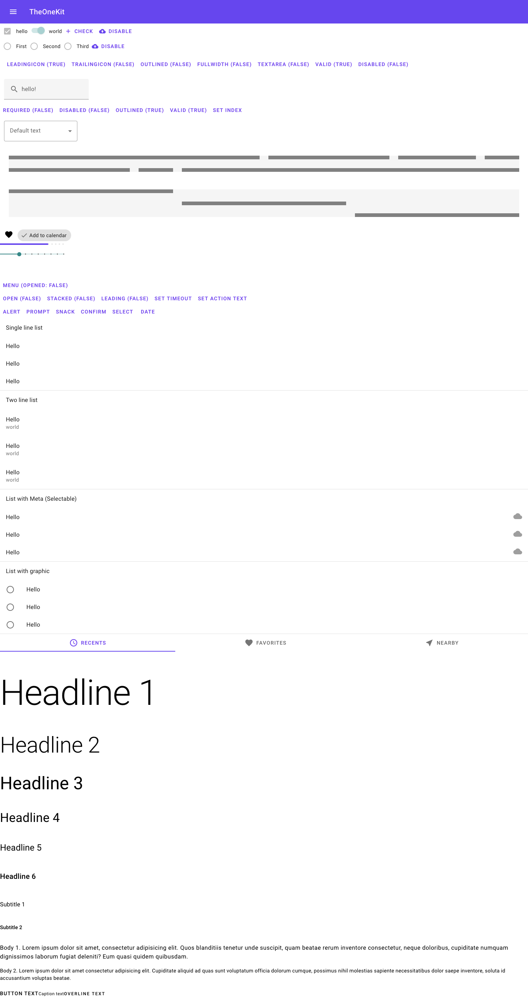

# TheOneKit

> RAD for CRUD without third party dependencies. Instead of utility piping for assembly, only TypeScript compiler required to make deployment

This toolkit is quite usefull for writing a user interface for a backend service that will be supported for a limited period of time. It aim to apply forms to "micro" backend services which implement templated functionality, for example, lists with limit and offset, authorisation and registration, data output on json-templated 12 columns layout

## What is included in?

 - [Preact](https://preactjs.com/)

    Fast 3kB alternative to React with the same modern API.

 - [Preact Hooks](https://preactjs.com/guide/v10/hooks)

    New concept of Preact components development that allows you to compose state and side effects. They allow you to reuse stateful logic between components.

 - [Preact Router](https://github.com/preactjs/preact-router)

    Connect your Preact components up to that address bar.

 - [MomentJS](https://momentjs.com/)

    Parse, validate, manipulate, and display dates and times in JavaScript.

 - [TypeStyle](https://github.com/typestyle/typestyle)

    A replacement for CSS Modules, supports *in-code css keyframes animations*

 - Custom ui components based on MDC

    **The most important**

## Why this component kit is important

It looks like this is the last ui kit which can be used with TypeScript defenitions without ES6 modules. Therefore, if you want to keep the ability to run your program in a decade without restoring connections in node_modules, look at this, it may come in handy. Also If you don't want to work without payment on deploying your ui after some time, this is especially useful for fixed-cost freelance work.

The practice of keeping dependencies remotely suitable for large enterprises with a constantly working devops department, but, is absolutely not applicable to microprojects. For example, due to the removal of the old node-sass binary distribution, the huge set of student projects ceased to compile and run

## Current status

A huge component set was created, but there is todos:

 - List component

   Displaying json-templated [material datagrid](https://material.io/develop/web/components/data-tables/) with limit and offset 

 - One component

   12 column based layout builder

 - Documentation

   Sample app whith will contain all of componenents in this kit

## Screenshot

